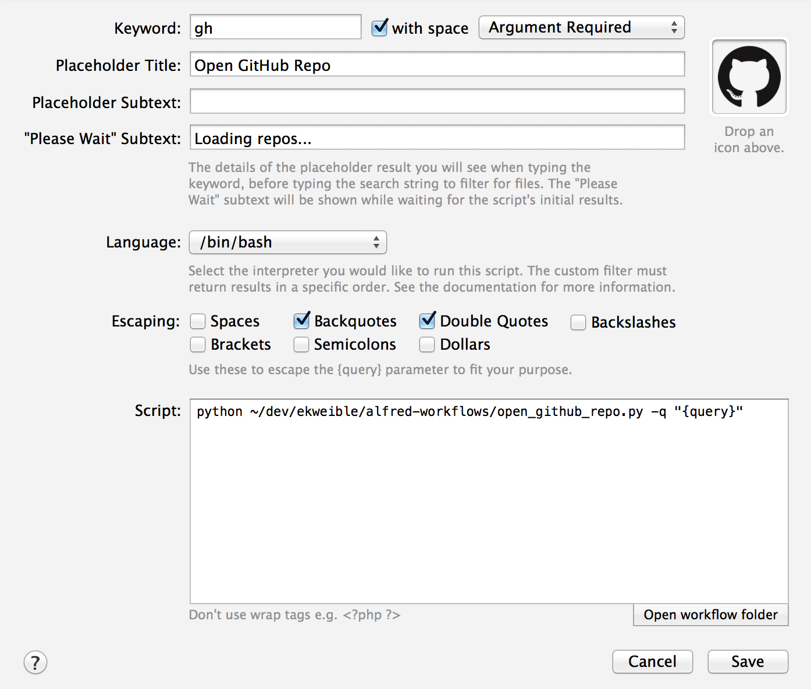
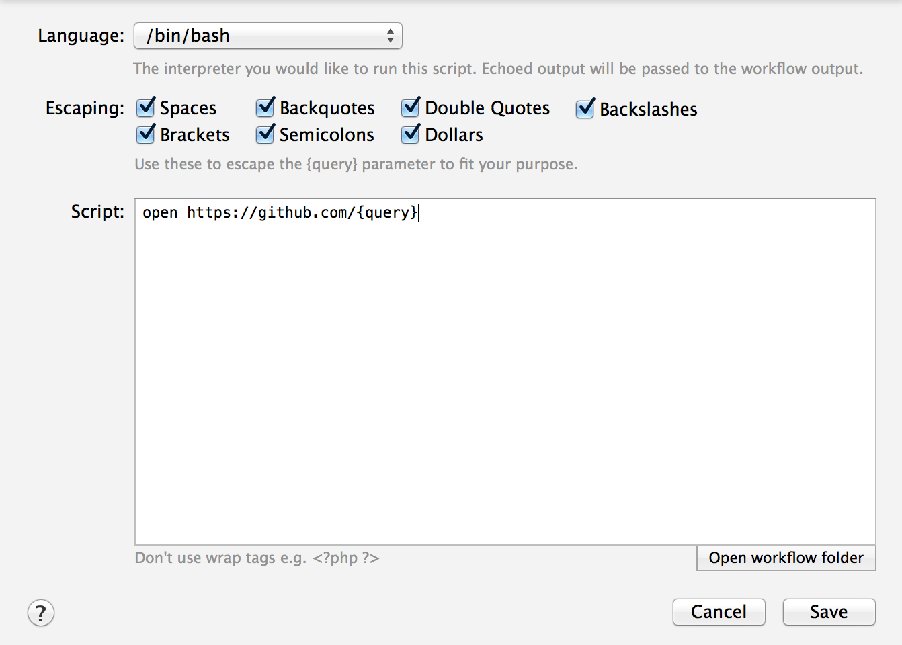
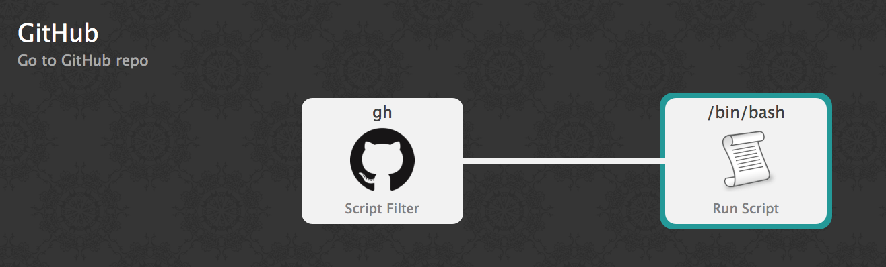

Alfred Workflows
---

> This repo contains a collection of [Alfred](http://www.alfredapp.com/) workflow scripts written in python.
> _Note: This requires Alfred Powerpack_

## Workflows
- [Open GitHub Repo](#open-github-repo)

## Open GitHub Repo
This workflow parses the query and matches the search terms (whitespace delimited) against a list of GitHub repos and a
list of GitHub users, and the matching results are returned to Alfred. Selecting one of the results will open that repo
in the browser.

#### Setup
- Open Alfred > Workflows
- Add a new workflow
  - Add a "Script Filter" input
    
  - _Be sure to drag the GitHub icon from the icons/ directory to this script filter input_
  - Add a "Run Script" action
    
  - Link the input to the action
    
- Update the JSON data files ([data/git_repos.json](data/git_repos.json), [data/git_users.json](data/git_users.json))
for your use

## Thanks
Shout out to the following people and tools:

- [Alfred](http://www.alfredapp.com/)
- Jan Müller's [alfred-python](https://github.com/nikipore/alfred-python)